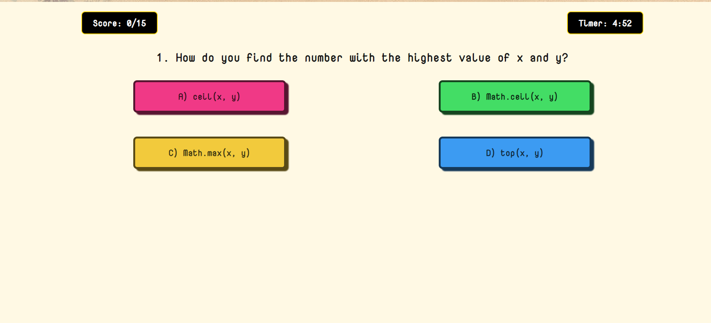

# Javascript Quiz Application

 
 
 <h3> Table of Contents </h3>

  <ol>
   <li>[Introduction](#introduction) </li>
   <li>[Live Preview](#live-preview) </li>
   <li>[Features](#features)</li>
   <li>[Installation](#installation) </li>
   <li> [Usage](#usage) </li>
   <li> [Dependencies](#usage)</li>
  </ol>

## Introduction

  
The Quiz Application is designed to provide an interactive quiz experience for users. It fetches quiz questions from an API, presents them to the user, and evaluates the user's knowledgeon basic javascript.

## Live Preview

To preview the application, click [here](https://courageous-swan-203f3c.netlify.app/)

## Features

- Fetches quiz questions from an API.
- Displays questions with multiple-choice options.
- Provides instant feedback on user answers.
- Calculates and displays the final score.
- Resets the quiz for a new attempt.
- Includes a timer for the overall quiz.
- Auto submit once time elapses.
- Device responsive design.

## Installation

This project doesn't require any specific installations or dependencies. Simply clone the repository to your local machine or download the source code files.

## Usage

1. Run the qpplication on a local server.
2. Click the "Start Quiz" button to begin.
3. Answer the multiple-choice questions by clicking on the options.
4. Receive immediate feedback on your answers.
5. Complete the quiz within the time limit

## Dependencies

- axios
